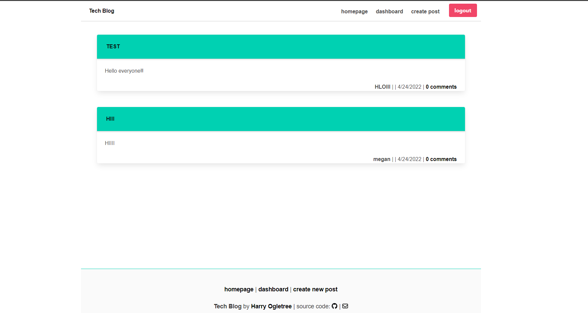

# harry-tech-p

## Description

The main purpose of this project is to build a CMS-style blog site in which users can publish articles, blog posts, and share their thoughts and opinions.

## Acceptance-Criteria

* When users visit the site for the first time, then they are presented with the homepage, which includes existing blog posts and navigation links for the homepage, dashboard and the option to log in.
* When users choose to sign up, then they are prompted to create a username and password
* When users click on the sign-up button, then the credentials are saved and they are logged into the site.
* When users revisit the site at a later time and choose to sign in, then they are prompted to enter my username and password.
* When users are signed in to the site, then they can see navigation links for the homepage, the dashboard, and the option to log out
* When users click on an existing blog post, then they are presented with the post title, contents, post creator’s username, and date created for that post and have the option to leave a comment.
* When users enter a comment and click on the submit button while signed in, then the comment is saved and the post is updated to display the comment, the comment creator’s username, and the date created.
* When users click on the dashboard option in the navigation, then they are taken to the dashboard and presented with any blog posts they have already created and the option to add a new blog post.
* When users click on the button to create a new blog post, then the title and contents of post are saved and they are taken back to an updated dashboard with the new blog post.
* When users click on one "Edit post" in the dashboard, then they are able to delete or update their posts.
* When users click on the logout option in the navigation, then they are signed out of the site
* When users are idle on the site for more than 10 minutes, then they are able to view comments but they have to login again before adding, updating, or deleting comments.

## Usage
Please first install node.js and then run the following commands into your terminal: 

```
git clone <from-repository-on-github>
npm install
node server.js
```
Before running "node server.js" command in your terminal, please make sure to update "connection.js" file with your mysql "username" and "password".

## Deployed-App

Please visit below link for the deployed application on heroku: 

[Link to Heroku App](https://obscure-waters-10506.herokuapp.com/)

## Screenshots

* Homepage



* Dashboard


* Login Page


* Post


